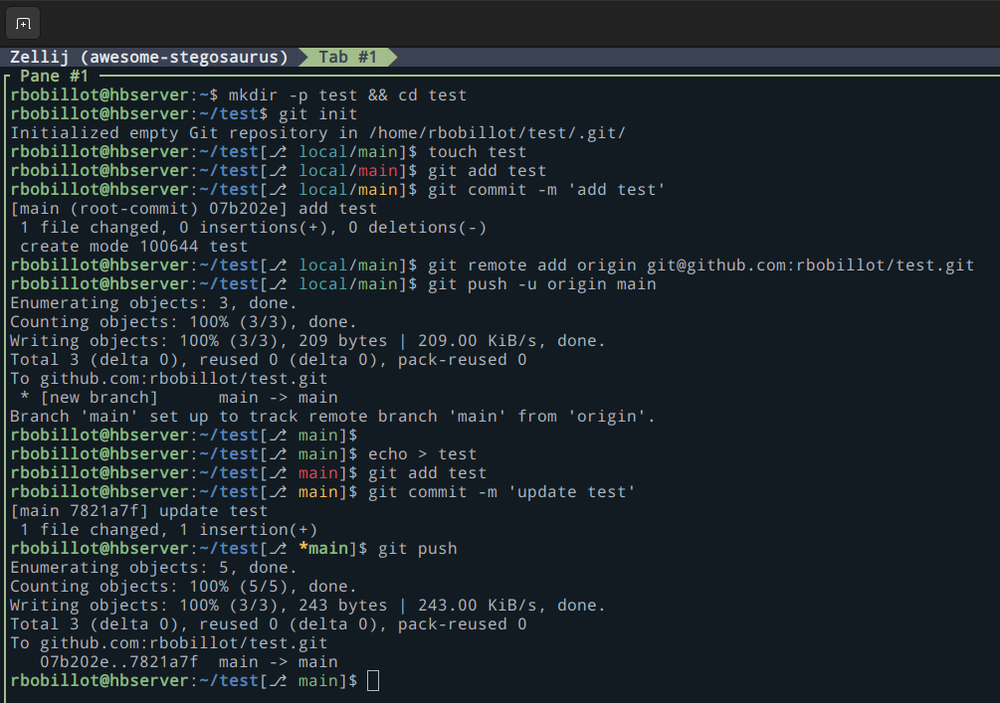

# git_prompt_show_branch
A simple (yet powerful) bash tool,
to display current working git branch status, in the PS1, using `bash`

Actually, I'm not a big fan of `zsh`, nor the existing tools for `bash`.
Yup, I'm a stupid hipster, and know it.

## Installation / Update (one-liner):
```bash
curl -s https://raw.githubusercontent.com/rbobillot/git_prompt_show_branch/main/install.bash | bash
```
## Simple Demo:

